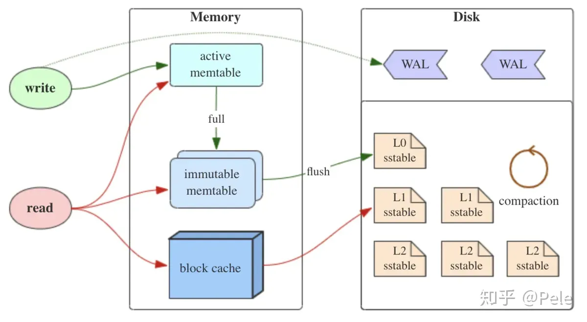

## leveldb概述

leveldb的特性存在于以下几个方面：

- 键值对存储
- LSMTree架构
- 多版本控制（MVCC）

## LSMTree 概述

> [ref: 论文阅读](https://zhuanlan.zhihu.com/p/361699941)  
> [ref: 结构分析](https://zhuanlan.zhihu.com/p/181498475)

LSMTree 整体架构如下：

### 顺序写入（追加写入）

LSM组织的页是**完全顺序写入**的，每一项通过标识位表明操作类型是增还是删。
> 这不同于B+树组织的页，后者会直接在数据项处修改相应的值。

完全顺序写入依赖于以下性质：

- SSTable 全部节点都是优先满的；

## 相关产品分析

### RocksDB

RocksDB是对leveldb的封装和优化，以实现更易用的KV存储引擎。

MyRocks是兼容MySQL的RocksDB实现。
> [ref: MyRocks及其使用场景分析](https://zhuanlan.zhihu.com/p/45652076)

MyRocks与InnoDB的性能分析如下图：

### HBase

HBase也是基于leveldb内核，更加专注于分布式场景。

