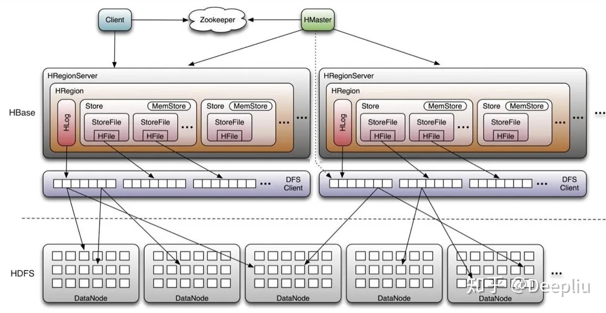

## leveldb 概述

leveldb 的特性存在于以下几个方面：

- 键值对存储
- LSMTree 架构
- 多版本控制（MVCC）

## LSMTree 概述

> [ref: 论文阅读](https://zhuanlan.zhihu.com/p/361699941)  
> [ref: 结构分析](https://zhuanlan.zhihu.com/p/181498475)

LSMTree 整体架构如下：

### 顺序写入

LSM 组织的页是**完全顺序写入**的，每一项通过标识位表明操作类型是增还是删。
> 这不同于 B+树组织的页，后者会直接在数据项处修改相应的值。

完全顺序写入依赖于以下性质：

- SSTable 全部节点都是优先满的；

### 快速过滤

查找时的快速过滤能力借助于 SSTable 保存的 MetaBlock（由 Bloom Filter 实现）。

## 相关产品分析

### RocksDB

RocksDB 是对 leveldb 的封装和优化，以实现更易用的 KV 存储引擎。

MyRocks 是兼容 MySQL 的 RocksDB 实现。
> [ref: MyRocks 及其使用场景分析](https://zhuanlan.zhihu.com/p/45652076)

MyRocks 与 InnoDB 的性能分析如下图：

### HBase

HBase 也是基于 leveldb 内核，更加专注于分布式场景。

> [ref: HBase 架构与原理详解](https://zhuanlan.zhihu.com/p/159052841)

HBase 的分布式架构如下：
